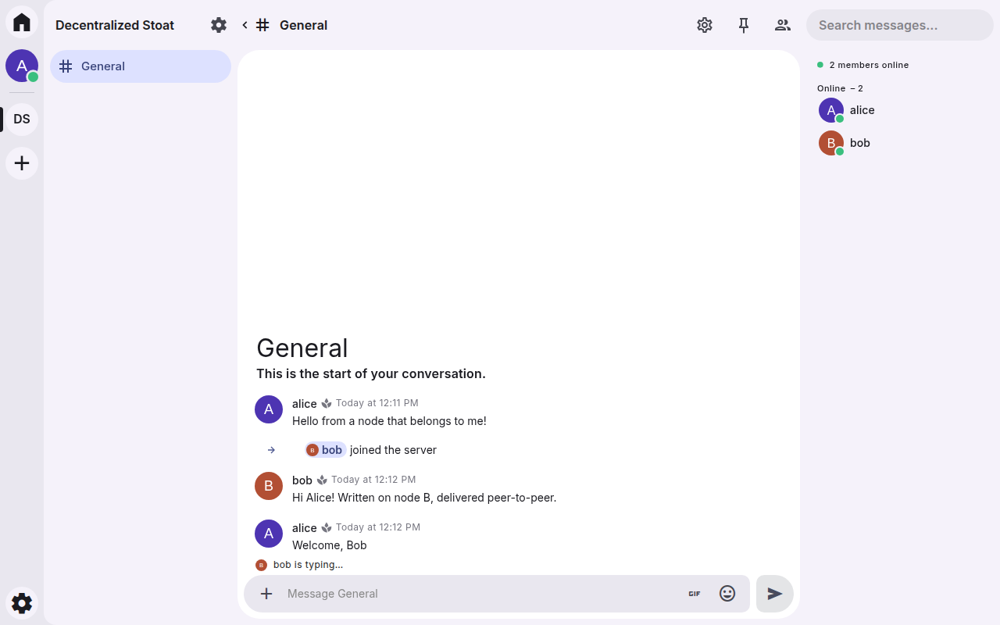
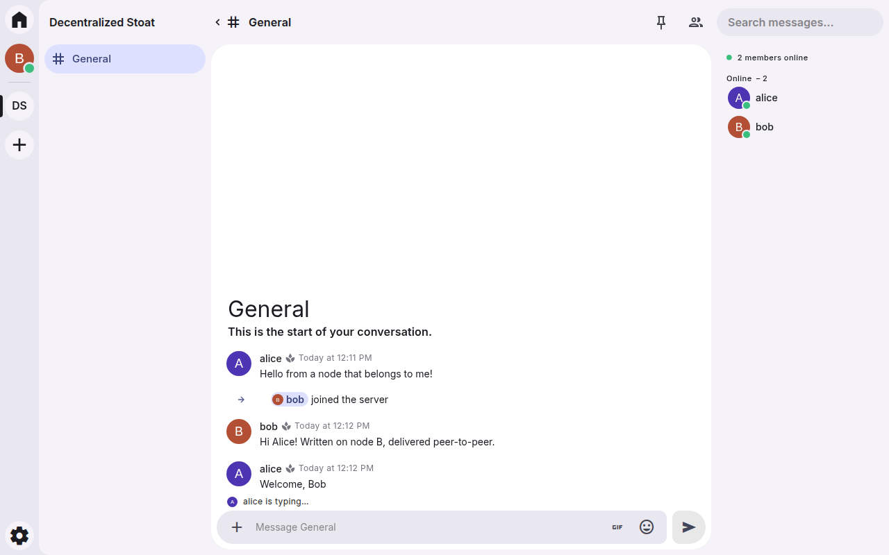

# Stoat P2P

**Децентрализованная (peer-to-peer) версия [Stoat](https://stoat.chat)** — открытого чата в духе Discord (бывший Revolt).
В обычном Stoat все серверы, сообщения и аккаунты хранятся на центральном бэкенде. В Stoat P2P центрального сервера нет:
каждый человек запускает **свой узел**, а узлы обмениваются подписанными событиями напрямую друг с другом.

Узел говорит на том же API, что и бэкенд Stoat (REST + WebSocket), поэтому **официальный веб‑клиент Stoat работает без
единой правки**: вы видите привычный интерфейс Stoat, но за ним ваш собственный узел, а не чужой сервер.

> Неофициальный проект, не связан с командой Stoat. Клиент — оригинальный
> [stoatchat/for-web](https://github.com/stoatchat/for-web), собранный из исходников без изменений.

| Узел A — Алиса | Узел B — Боб |
| --- | --- |
|  |  |

*Скриншоты из автоматического e2e‑теста: два узла, два браузера, официальный клиент Stoat. Боб вступил по коду
приглашения — его узел ни разу не видел этот сервер и получил его историю от узла Алисы.*

---

## Как это устроено

```
  Браузер (официальный клиент Stoat)            Браузер (официальный клиент Stoat)
        │  REST /api, WebSocket /events, файлы /autumn        │
  ┌─────▼──────┐        P2P: WebSocket /p2p           ┌──────▼─────┐
  │ Узел Алисы │◄────────────────────────────────────►│ Узел Боба  │
  │ (ноутбук)  │                                      │ (домашний) │
  └─────┬──────┘                                      └──────┬─────┘
        │            ┌─────────────────────────┐             │
        └───────────►│ Хаб‑ретранслятор (VPS),  │◄────────────┘
                     │ необязателен: для NAT    │
                     └─────────────────────────┘
```

* **Личность — это ключ.** При регистрации узел создаёт пару ключей Ed25519. ID пользователя (ULID, как в Stoat)
  вычисляется из хеша публичного ключа, поэтому подделать чужой ID нельзя. Email и пароль — только для входа
  в *ваш* узел, наружу они не уходят.
* **Всё — подписанные события.** Создание сервера, канал, роль, бан, сообщение, реакция, смена аватара — это
  событие, подписанное ключом автора и адресуемое хешем. Узлы проверяют каждую подпись сами.
* **Одинаковое состояние без координатора.** События сервера образуют DAG (каждое ссылается на то, что видел
  автор). Все узлы упорядочивают DAG одинаково и «сворачивают» его, применяя модель прав Stoat (роли, ранги,
  переопределения каналов, тайм‑ауты). Событие без нужного права просто ничего не меняет — на *любом* узле.
  Тест проверяет, что при 12 разных порядках доставки состояние совпадает бит в бит.
* **Кто что получает.** Данные сервера узел отдаёт только тому, кто доказал владение ключом участника или
  предъявил действующее приглашение. Ретранслятор получает от пользователей подписанное делегирование.
* **Личные сообщения зашифрованы сквозным шифрованием** (X25519 + ChaCha20‑Poly1305): ретранслятор хранит и
  пересылает их, но прочитать не может.
* **Синхронизация.** Новые события рассылаются сразу; после переподключения узлы сверяют «корзины» событий
  по дням и докачивают недостающее. Узел, который был офлайн, догоняет историю автоматически.

Подробности: [docs/ARCHITECTURE.md](docs/ARCHITECTURE.md) и [docs/PROTOCOL.md](docs/PROTOCOL.md).

## Быстрый старт

Нужны **Node.js ≥ 22.18** (TypeScript запускается напрямую, без сборки) и **git**.

```bash
git clone https://github.com/celovek097/stoat-p2p
cd stoat-p2p
npm ci
npm run build:web   # один раз: собирает официальный клиент Stoat из исходников (2–5 минут)
npm start
```

Откройте **http://localhost:14702**, нажмите «Create account» (email и пароль хранятся только на вашем узле),
выберите имя — готово. Панель узла (адреса, пиры, подключение к другу): **http://localhost:14702/node**.

### Как пообщаться с друзьями

1. **В одной локальной сети** — ничего делать не нужно: узлы находят друг друга сами (UDP multicast).
2. **Через интернет** — хотя бы один узел должен быть доступен снаружи (проброшенный порт 14702 или VPS).
   Второй человек подключается к нему:
   ```bash
   npm start -- --peer ws://friend.example.org:14702/p2p
   ```
   или вставляет адрес в форму «Connect to a peer» на странице `/node`.
3. **Хаб для компании** — всегда включённый узел на VPS, к которому подключаются все (помогает тем, кто за NAT,
   и хранит историю, пока ваши ноутбуки выключены):
   ```bash
   npm start -- --relay --announce ws://hub.example.org:14702/p2p
   ```

Дальше всё как в обычном Stoat: создайте сервер → правый клик по каналу → **Create Invite** → отправьте код.
Друг на своём узле нажимает **+** → **Join** → вставляет код. Его узел найдёт сервер через пиров, скачает
историю и вступит.

### Docker

```bash
docker compose up --build
```

Поднимется демо‑сеть: хаб и два личных узла. Откройте http://localhost:14701 (узел Алисы) и
http://localhost:14703 (узел Боба) в разных браузерах. Для своего узла:

```bash
docker build -t stoat-p2p .
docker run -p 14702:14702 -v stoat-p2p:/data stoat-p2p node src/cli.ts --peer ws://hub.example.org:14702/p2p
```

### Параметры

| Флаг | Переменная | Назначение |
| --- | --- | --- |
| `--data <dir>` | `STOAT_P2P_DATA` | каталог данных (по умолчанию `~/.stoat-p2p`) |
| `--port <n>` | `STOAT_P2P_PORT` | порт HTTP/WebSocket (14702) |
| `--peer <url>` | `STOAT_P2P_PEERS` | пир для подключения (можно несколько) |
| `--announce <url>` | `STOAT_P2P_ANNOUNCE` | ваш публичный адрес, который узнают пиры |
| `--relay` | `STOAT_P2P_RELAY=1` | режим хаба: хранить и пересылать данные подключённых узлов |
| `--no-lan` | `STOAT_P2P_LAN=0` | отключить поиск узлов в локальной сети |
| `--no-registration` | `STOAT_P2P_REGISTRATION=0` | запретить создание новых аккаунтов на узле |
| `--trust-proxy` | `STOAT_P2P_TRUST_PROXY=1` | доверять `X-Forwarded-*` (за reverse proxy с TLS) |
| `--name <name>` | `STOAT_P2P_NAME` | имя узла для пиров |

### Перенос личности на другой узел

Ваша личность — это ключи. Их можно забрать с собой, сохранив ID, серверы и историю:

```bash
stoat-p2p identity export --email me@example.org > me.json            # на старом узле
stoat-p2p identity import --email me@example.org --password '...' < me.json   # на новом
```

Новый узел сам спросит у пиров, в каких серверах и переписках вы состоите, и скачает их. Храните файл
`me.json` как приватный ключ.

## Что работает

| Возможность | Статус |
| --- | --- |
| Аккаунты, вход, сессии, онбординг, несколько аккаунтов на одном узле | ✅ локально на узле |
| Серверы, каналы, категории, системные сообщения | ✅ |
| Роли, ранги, права сервера и каналов (модель Stoat), тайм‑ауты | ✅ проверяются каждым узлом |
| Приглашения, вступление, выход, кик, бан | ✅ |
| Сообщения: markdown, правки, удаление, ответы, упоминания, реакции, закрепление | ✅ |
| Файлы: вложения, аватары, иконки, баннеры, свои эмодзи | ✅ контент‑адресация, докачка с пиров |
| Личные сообщения | ✅ со сквозным шифрованием |
| Друзья, блокировка | ✅ |
| Онлайн‑статус, «печатает…», непрочитанное, поиск по каналу | ✅ |
| Перенос личности между узлами | ✅ |
| Голос и видео (LiveKit) | ❌ пока нет |
| Групповые ЛС, боты, вебхуки, превью ссылок, push‑уведомления | ❌ пока нет |
| Восстановление пароля по email, MFA | ❌ не нужно для локальных аккаунтов (используйте экспорт ключей) |

## Безопасность и ограничения

Честно о том, что есть и чего нет:

* Подписи и права проверяет **каждый** узел: чужой узел не может написать от вашего имени, переименовать
  сервер без права `ManageServer` или раздать роль выше своей.
* Содержимое **серверов не зашифровано сквозным шифрованием**: его видят узлы участников и ретрансляторы,
  которым участники выдали делегирование (как в Discord/Stoat его видит оператор сервера). ЛС — зашифрованы.
* Трафик между узлами по `ws://` не шифруется. Для интернета ставьте узел за reverse proxy с TLS и
  используйте `wss://` адреса.
* Ключи хранятся в каталоге данных без шифрования (файлы с правами `0600`) — защищайте диск.
* Участник, которого забанили, теоретически может «задним числом» подписать сообщения со старыми ссылками;
  такие сообщения после бана скрываются («soft fail», как в Matrix), но это эвристика.
* Нет NAT hole punching: если оба узла за NAT, нужен общий хаб или проброс порта.
* Это исследовательский прототип (v0.1). Формат протокола может измениться.

## Для разработчиков

```bash
npm run typecheck   # tsc
npm test            # 27 тестов: ядро, детерминизм, API через официальный SDK stoat.js, P2P‑сценарии
npm run test:e2e    # два узла + два браузера с официальным клиентом (нужны build:web и Chromium)
```

Интеграционные тесты используют **официальный SDK `stoat.js`** как клиента, так что совместимость с API
Stoat проверяется настоящим клиентским кодом. P2P‑сценарии: вступление через сеть, ретранслятор между
узлами за NAT, догон после офлайна, модерация, E2E‑шифрование ЛС и репликация файлов, перенос личности.

```
src/
  core/      события, подписи, самоудостоверяемые ID, журнал событий
  state/     детерминированное состояние серверов, права Stoat, сообщения, ЛС, профили
  api/       REST API и WebSocket (протокол Stoat), файлы (Autumn), раздача клиента, панель /node
  p2p/       пиры, рукопожатие, контроль доступа, синхронизация, поиск приглашений, LAN
  node.ts    узел целиком; cli.ts — запуск
test/        unit, integration (stoat.js), e2e (Playwright + официальный клиент)
scripts/     сборка официального веб-клиента Stoat
```

## Лицензия

[AGPL-3.0-or-later](LICENSE), как и сам Stoat. Узел написан с нуля и реализует публичный API Stoat;
веб‑клиент — оригинальный код Stoat (AGPL‑3.0), который собирается из исходников скриптом
`scripts/build-web.sh`. «Stoat» — название проекта его авторов; этот проект независимый.

---

### In English

**Stoat P2P** is an unofficial, decentralized version of [Stoat](https://stoat.chat). Everyone runs their own node;
the node implements the Stoat API (REST + events WebSocket + Autumn files), so the **official Stoat web client works
unmodified** on top of it. All state is made of signed, content-addressed events that nodes replicate over WebSocket.
Server state is a DAG folded deterministically with Stoat's permission model on every node; access to a server's data
requires proving a member's key or presenting an invite; DMs are end-to-end encrypted; relays can bridge NATed nodes.
Quick start: `npm ci && npm run build:web && npm start`, then open http://localhost:14702. See
[docs/ARCHITECTURE.md](docs/ARCHITECTURE.md) and [docs/PROTOCOL.md](docs/PROTOCOL.md).
