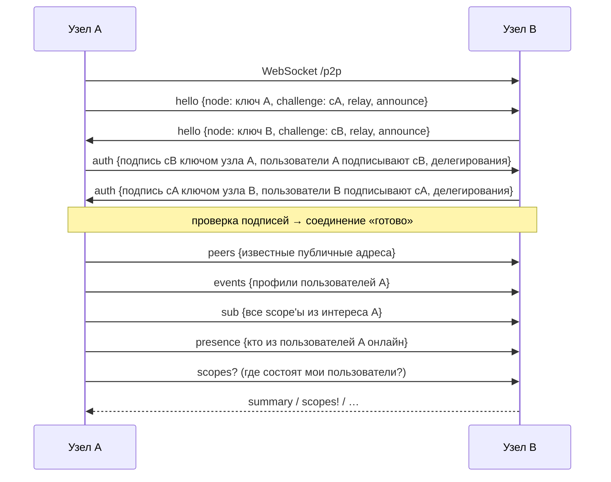
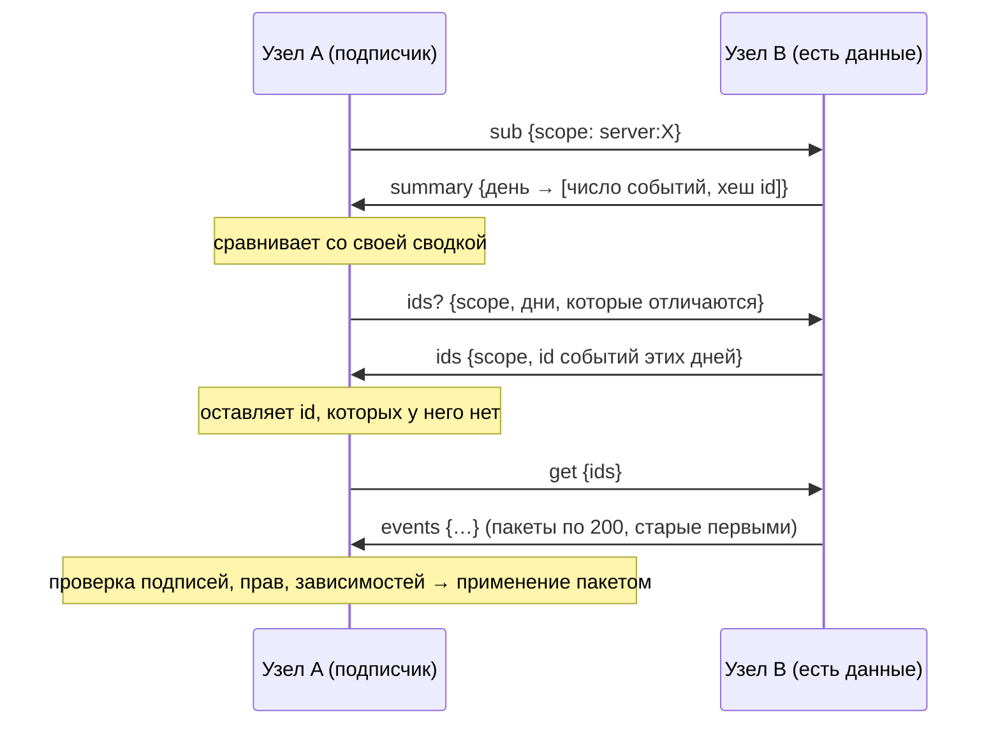

# P2P в Stoat P2P: полное руководство

Этот документ описывает одноранговую (peer-to-peer) часть проекта целиком: понятия, топологии сети,
установку и настройку узлов, все механизмы синхронизации (с диаграммами), безопасность, эксплуатацию,
диагностику и ответы на частые вопросы.

Смежные документы:

* [ARCHITECTURE.md](ARCHITECTURE.md) — устройство узла и детерминированное состояние серверов;
* [PROTOCOL.md](PROTOCOL.md) — точная спецификация формата событий и сетевых кадров.

## Содержание

1. [Основные понятия](#1-основные-понятия)
2. [Топологии сети](#2-топологии-сети)
3. [Установка и запуск узла](#3-установка-и-запуск-узла)
4. [Подключение узлов друг к другу](#4-подключение-узлов-друг-к-другу)
5. [Узел в интернете: TLS, reverse proxy, systemd](#5-узел-в-интернете-tls-reverse-proxy-systemd)
6. [Жизненный цикл соединения](#6-жизненный-цикл-соединения)
7. [Что и кому узел отдаёт](#7-что-и-кому-узел-отдаёт)
8. [Синхронизация данных](#8-синхронизация-данных)
9. [Сценарии по шагам](#9-сценарии-по-шагам)
10. [Ретрансляторы (хабы)](#10-ретрансляторы-хабы)
11. [Личные сообщения и сквозное шифрование](#11-личные-сообщения-и-сквозное-шифрование)
12. [Файлы](#12-файлы)
13. [Онлайн-статус и «печатает…»](#13-онлайн-статус-и-печатает)
14. [Личность, несколько устройств и перенос](#14-личность-несколько-устройств-и-перенос)
15. [Модель угроз](#15-модель-угроз)
16. [Эксплуатация: данные, резервные копии, обновления](#16-эксплуатация-данные-резервные-копии-обновления)
17. [Панель узла и API состояния](#17-панель-узла-и-api-состояния)
18. [Диагностика неполадок](#18-диагностика-неполадок)
19. [Параметры и константы](#19-параметры-и-константы)
20. [FAQ](#20-faq)

---

## 1. Основные понятия

| Понятие | Что это |
| --- | --- |
| **Узел (node)** | Процесс `stoat-p2p`. Хранит данные, раздаёт веб‑клиент Stoat и API своим пользователям, общается с другими узлами. У узла есть свой ключ Ed25519 (`node.json`), по нему его узнают пиры. |
| **Пир (peer)** | Другой узел, с которым установлено соединение по WebSocket (`/p2p`). |
| **Пользователь** | Личность = пара ключей Ed25519. ID пользователя (ULID) вычисляется из публичного ключа. Пользователь «живёт» на узле, где лежат его ключи; на одном узле может быть несколько пользователей. |
| **Событие** | Неизменяемая подписанная запись: «создан канал», «отправлено сообщение», «забанен пользователь». Адресуется своим хешем. Всё состояние сети — это множество событий. |
| **Scope (область)** | Группа событий, которые синхронизируются вместе: `server:<id>` (сервер со всеми каналами и сообщениями), `dm:<a>:<b>` (личная переписка и отношения пары), `user:<id>` (профиль), `saved:<id>` (заметки, только локально). |
| **Интерес** | Набор scope'ов, за которыми следит узел: серверы, где состоят его пользователи, их ЛС, профили знакомых. |
| **Ретранслятор (relay, хаб)** | Узел с флагом `--relay`: хранит и пересылает данные подключённых к нему узлов, даже когда те выключены. Своих пользователей может не иметь. |
| **Делегирование** | Подписанное пользователем разрешение ретранслятору действовать от его имени при синхронизации (на 7 дней). |

Главное свойство: **узлы не доверяют друг другу**. Любое событие проверяется каждым узлом заново: подпись,
соответствие ключа автору, права автора по модели Stoat. Поэтому пир может лишь *передать* данные, но не
подделать их и не обойти права.

## 2. Топологии сети

Сеть не имеет центра, и одна и та же программа годится для любой из схем ниже. Их можно смешивать.

### 2.1. Локальная сеть (дом, офис, хакерспейс)

```
 ┌────────┐   UDP multicast   ┌────────┐
 │ Узел A │◄────────────────►│ Узел B │
 └────────┘  + WebSocket /p2p └────────┘
```

Узлы находят друг друга сами через UDP‑маяк (`239.255.47.70:47470`) и соединяются напрямую. Ничего
настраивать не нужно.

### 2.2. Прямое соединение через интернет

```
 ┌────────────────┐      ws(s)://friend.example.org:14702/p2p      ┌───────────────────┐
 │ Узел A (за NAT)│───────────────────────────────────────────────►│ Узел B (белый IP) │
 └────────────────┘                                                └───────────────────┘
```

Достаточно, чтобы **один** из узлов был доступен снаружи (белый IP, проброшенный порт или VPS). Узел за NAT
подключается к нему исходящим соединением; дальше обмен идёт в обе стороны по этому соединению.

### 2.3. Хаб для сообщества

```
          ┌────────┐
          │ Узел A │──┐
          └────────┘  │      ┌──────────────────────┐
          ┌────────┐  ├─────►│ Хаб (--relay, VPS)   │
          │ Узел B │──┤      │ хранит и пересылает  │
          └────────┘  │      └──────────────────────┘
          ┌────────┐  │
          │ Узел C │──┘
          └────────┘
```

Все подключаются к одному всегда включённому хабу. Хаб помогает узлам за NAT и хранит историю, пока личные
узлы выключены. При этом он **не главный**: права проверяет каждый узел, события подписаны пользователями,
ЛС хаб прочитать не может. Если хаб пропадёт, узлы, знающие адреса друг друга, продолжат работать напрямую.

### 2.4. Сеть из нескольких хабов

```
  A ── Хаб‑1 ═══ Хаб‑2 ── B
          ║
        Хаб‑3 ── C
```

Хабы подключаются друг к другу (`--peer`) и пересылают данные дальше. Делегирования, полученные хабом от своих
пользователей, он предъявляет соседним хабам, поэтому данные доходят по цепочке. Поиск приглашения проходит
до двух переходов (`ttl = 2`).

### 2.5. Общий узел на несколько человек

Один узел может обслуживать нескольких пользователей: семью, небольшую команду (как домашний сервер в
Matrix). Каждый входит в веб‑клиент своим email и паролем, у каждого свои ключи. Чтобы посторонние не
заводили аккаунты, используйте `--no-registration` после создания нужных аккаунтов.

## 3. Установка и запуск узла

### Требования

* Node.js **22.18+** (TypeScript исполняется напрямую, без компиляции).
* git — для сборки веб‑клиента.
* ~100 МБ диска на клиент плюс данные.

### Из исходников

```bash
git clone https://github.com/celovek097/stoat-p2p
cd stoat-p2p
npm ci
npm run build:web      # собирает официальный клиент Stoat (один раз, 2–5 минут)
npm start              # http://localhost:14702
```

Без `npm run build:web` узел тоже работает: API, P2P и панель `/node` доступны, а на `/` будет подсказка, как
собрать клиент. К узлу можно подключить и любой другой Stoat‑совместимый клиент.

### Docker

```bash
docker build -t stoat-p2p .
docker run -d --name stoat -p 14702:14702 -v stoat-data:/data stoat-p2p \
  node src/cli.ts --name my-node --peer wss://hub.example.org/p2p
```

Демо‑сеть из хаба и двух узлов: `docker compose up --build`, затем http://localhost:14701 и
http://localhost:14703. Внутри Docker‑моста поиск по локальной сети обычно не работает, поэтому в демо узлы
связаны через хаб явно.

### Первый вход

1. Откройте адрес узла, нажмите **Create account**. Email и пароль нужны только для входа в этот узел,
   письма не отправляются.
2. Введите имя пользователя. В этот момент создаются ключи, а в сеть публикуется ваш профиль.
3. Откройте **/node** — там адреса вашего узла и список пиров.

## 4. Подключение узлов друг к другу

Узел узнаёт о пирах пятью способами.

| Способ | Как включить | Когда подходит |
| --- | --- | --- |
| Явный адрес | `--peer ws://host:14702/p2p` (можно несколько) или `STOAT_P2P_PEERS=url1,url2` | подключение к другу или хабу |
| Панель узла | форма «Connect to a peer» на `/node` (только с этого же компьютера) | без перезапуска |
| Локальная сеть | включено по умолчанию; выключается `--no-lan` | дом, офис |
| Обмен адресами | автоматически: пиры сообщают друг другу публичные адреса (`--announce`) | рост сети |
| Адреса в профиле | автоматически: профиль пользователя содержит адреса его узла (`--announce`) | ЛС с человеком, до узла которого ещё нет соединения |

Адреса, добавленные через `--peer` или панель, запоминаются в `peers.json` и восстанавливаются после
перезапуска. Узел переподключается к ним с экспоненциальной задержкой (1 → 2 → … → 60 с). Адреса, узнанные
автоматически, забываются после 5 неудачных попыток.

**`--announce`** — адрес, по которому *другие* могут подключиться к вашему узлу. Указывайте его только если
узел действительно доступен снаружи, например `--announce wss://chat.example.org/p2p`. Узел без
`--announce` может подключаться сам, но к нему никто не придёт.

## 5. Узел в интернете: TLS, reverse proxy, systemd

Между узлами по `ws://` трафик не шифруется, поэтому в интернете узел ставят за reverse proxy с TLS и
раздают адрес `wss://`. Проксировать нужно HTTP и WebSocket (`/p2p` для пиров, `/events` для клиента).

### Caddy

```caddy
chat.example.org {
    reverse_proxy 127.0.0.1:14702
}
```

Caddy сам получает сертификат и проксирует WebSocket.

### nginx

```nginx
server {
    listen 443 ssl http2;
    server_name chat.example.org;
    ssl_certificate     /etc/letsencrypt/live/chat.example.org/fullchain.pem;
    ssl_certificate_key /etc/letsencrypt/live/chat.example.org/privkey.pem;
    client_max_body_size 25m;                     # вложения до 20 МБ

    location / {
        proxy_pass http://127.0.0.1:14702;
        proxy_http_version 1.1;
        proxy_set_header Upgrade $http_upgrade;     # WebSocket: /p2p и /events
        proxy_set_header Connection "upgrade";
        proxy_set_header Host $host;
        proxy_set_header X-Forwarded-Proto $scheme;
        proxy_set_header X-Forwarded-Host $host;
        proxy_set_header X-Forwarded-For $proxy_add_x_forwarded_for;
        proxy_read_timeout 1h;
    }
}
```

Запуск узла за прокси:

```bash
node src/cli.ts --host 127.0.0.1 --trust-proxy \
  --announce wss://chat.example.org/p2p --relay --name example-hub
```

* `--trust-proxy` включает учёт заголовков `X-Forwarded-*`: клиент получит адреса `https://` и `wss://`.
* `--host 127.0.0.1` — узел доступен только через прокси.
* Запросы, прошедшие через прокси, панель `/node` считает удалёнными: добавлять пиров через веб‑форму тогда
  нельзя, используйте `--peer` или откройте панель по SSH‑туннелю
  (`ssh -L 14702:127.0.0.1:14702 server`, затем http://localhost:14702/node).

### systemd

```ini
# /etc/systemd/system/stoat-p2p.service
[Unit]
Description=Stoat P2P node
After=network-online.target

[Service]
User=stoat
WorkingDirectory=/opt/stoat-p2p
ExecStart=/usr/bin/node src/cli.ts --data /var/lib/stoat-p2p --host 127.0.0.1 --trust-proxy --relay --announce wss://chat.example.org/p2p
Restart=on-failure

[Install]
WantedBy=multi-user.target
```

```bash
sudo systemctl enable --now stoat-p2p
journalctl -u stoat-p2p -f
```

### Сетевые порты

| Порт | Протокол | Назначение |
| --- | --- | --- |
| 14702/tcp | HTTP + WebSocket | веб‑клиент, API, `/events`, `/autumn`, `/p2p`, `/node` |
| 47470/udp | multicast | поиск узлов в локальной сети (не нужен в интернете) |

## 6. Жизненный цикл соединения



1. **Hello.** Стороны обмениваются ключами узлов и случайными вызовами (`challenge`).
2. **Auth.** Каждая сторона подписывает вызов собеседника ключом узла, а каждый её пользователь — своим
   ключом. Так пир узнаёт, **каких пользователей представляет** узел. Подделать это нельзя без их ключей.
3. **Дубликаты.** Если к узлу уже есть соединение (оба набрали друг друга), остаётся одно — открытое узлом с
   меньшим ключом. Решение одинаково на обеих сторонах.
4. **Старт синхронизации:** обмен адресами, проактивная отправка профилей, подписки, онлайн‑статус, вопрос
   «в каких scope'ах состоят мои пользователи».
5. **Поддержание.** Каждые 30 с WebSocket‑ping. Если ответа нет, соединение закрывается и переустанавливается.
   Каждые 5 минут — повторная сверка всех подписок (анти‑энтропия).
6. **Новые пользователи.** Если на узле создали аккаунт уже после рукопожатия, узел рассылает кадр `users`
   с новыми доказательствами и профилем. Переподключаться не нужно.
7. **Разрыв.** Онлайн‑статус пользователей пира сбрасывается, узел переподключается по известным адресам.
   После восстановления сверка докачивает всё пропущенное.

Соединение, не прошедшее рукопожатие за 15 секунд, закрывается.

## 7. Что и кому узел отдаёт

Проверка выполняется **при каждой отправке** события, сводки или списка id, а не только при подписке.
Поэтому бан или выход из сервера сразу перекрывает доступ.

| Scope | Пир получает данные, если… |
| --- | --- |
| `user:<id>` | всегда: профили публичны |
| `server:<id>` | пир представляет **текущего участника** сервера (сам или по делегированию) **или** предъявил в `sub` **действующий код приглашения** этого сервера |
| `dm:<a>:<b>` | пир представляет `a` или `b` (сам или по делегированию) |
| `saved:<id>` | никогда |

Принимает узел только события тех scope'ов, которые ему интересны, а также профили, присланные узлом,
который представляет автора профиля. Непрошеные события отбрасываются, поэтому посторонний узел не может
«залить» чужой узел мусором. Внутри сервера есть и второй фильтр: события от авторов, которые никогда не
пытались вступить, не сохраняются и не пересылаются.

## 8. Синхронизация данных

### 8.1. Живая рассылка

Когда узел принимает новое событие (своё или от пира), он пересылает его всем пирам, которые подписаны на
этот scope и имеют к нему доступ. Источник исключается. Дубликаты отсекаются по id, поэтому циклов нет,
даже если сеть образует кольцо.

### 8.2. Сверка (reconciliation)

Используется при подключении, при подписке на новый scope и раз в 5 минут.



* События группируются по дням (`floor(ts / 86 400 000)`). Если хеш дня совпал, этот день не передаётся:
  повторная сверка синхронной пары стоит одну сводку.
* Обе стороны подписываются друг на друга, поэтому недостающее докачивается в обе стороны.
* Пакет применяется как одна транзакция: состояние сервера пересчитывается один раз, клиенты получают
  итоговые изменения.

### 8.3. Причинный порядок

Каждое событие содержит `deps` — id событий, которые видел автор. Узел не применяет событие, пока у него нет
всех зависимостей:

1. событие откладывается в очередь ожидания (до 20 000 событий, до 15 минут);
2. недостающие зависимости запрашиваются (`get`) у пира, приславшего событие;
3. когда зависимость приходит, ожидающие события применяются каскадом.

Поэтому сообщение никогда не появится раньше канала, правка — раньше сообщения, а реакция — раньше того,
на что она поставлена.

### 8.4. Одинаковый результат на всех узлах

События состояния сервера образуют DAG, который каждый узел упорядочивает одинаково (глубина, время, id) и
сворачивает с проверкой прав. При конкурирующих изменениях, например два администратора одновременно
переименовали сервер, все узлы выберут одно и то же. Подробно — в [ARCHITECTURE.md](ARCHITECTURE.md).

## 9. Сценарии по шагам

### 9.1. Вступление по приглашению на незнакомый сервер

```mermaid
sequenceDiagram
    participant Bob as Клиент Боба
    participant NB as Узел Боба
    participant NA as Узел Алисы
    Bob->>NB: POST /api/invites/CODE
    NB->>NA: invite? {code: CODE, ttl: 2}
    NA-->>NB: invite! {scope: server:X}
    NB->>NA: sub {scope: server:X, invite: CODE}
    Note over NA: код действителен → доступ разрешён
    NA-->>NB: summary → ids → events (вся история сервера)
    Note over NB: код найден в состоянии → публикует member.join
    NB->>NA: event member.join (подписан ключом Боба)
    NB-->>Bob: 200 {server, channels}; ServerCreate по WebSocket
    Note over NA: проверяет join, клиенты Алисы получают ServerMemberJoin
```

Если среди прямых пиров узла Боба нет узла с этим сервером, вопрос `invite?` пересылают ретрансляторы.
Ответивший ретранслятор сначала сам подписывается на сервер с этим кодом, а затем отвечает Бобу.

### 9.2. Сообщение

1. Клиент → `POST /api/channels/:id/messages` на свой узел.
2. Узел проверяет `SendMessage`, подписывает `message.send` и указывает в `deps` текущие «головы» сервера.
3. Узел применяет событие у себя, сообщает своим клиентам (`Message`) и рассылает пирам.
4. Каждый пир проверяет подпись и то, что автор был участником на момент своих `deps` и сейчас имеет право
   писать, затем сообщает своим клиентам и пересылает дальше.

### 9.3. Бан

1. Модератор публикует `ban.create`. Его узел заранее проверяет права и ранги (`BanMembers`, цель ниже по
   рангу).
2. Все узлы применяют бан в свёртке. Участник исчезает из сервера, его клиент получает `ServerMemberLeave`,
   а узлу забаненного больше не отдаются новые события сервера.
3. Сообщения забаненного, подписанные «задним числом» (со временем позже бана), скрываются на всех узлах.

### 9.4. Узел был выключен неделю

При подключении узел подписывается на все свои scope'ы. Сводки по дням покажут отличия только за эту неделю,
и узел скачает недостающее от любого пира: хаба, друга или любого другого участника. Историю может отдать
любой участник, не только автор.

### 9.5. Два человека за NAT без хаба

Напрямую не получится: должен быть узел, доступный обоим. Варианты:

* один пробрасывает порт 14702 на роутере и указывает `--announce`;
* кто‑то поднимает хаб на VPS (`--relay --announce`);
* оба в одной локальной сети — тогда всё находится само.

## 10. Ретрансляторы (хабы)

Хаб — обычный узел с `--relay`. Отличия:

* **Интерес** хаба — все scope'ы, на которые подписаны его пиры. Он подписывается на них у других своих
  пиров и тем самым становится мостом.
* **Делегирования.** Узел, подключаясь к хабу (`relay: true` в `hello`), передаёт ему `grants`: подписи
  своих пользователей «этот хаб может синхронизироваться от моего имени до даты X» (7 дней, обновляются
  при переподключении). Хаб предъявляет их другим узлам как `delegations`, и те отдают ему данные тех
  серверов и ЛС, где состоят эти пользователи.
* **Приглашения.** Хаб пересылает вопросы `invite?` своим пирам (`ttl` уменьшается).
* **Файлы.** Если у хаба нет запрошенного файла, он сам запрашивает его у своих пиров, кэширует и отдаёт.
* **Онлайн‑статус и «печатает…».** Хаб пересылает их между узлами, которые не соединены напрямую.

Что хаб видит: содержимое серверов, в которых состоят его пользователи (как их узлы), профили и
метаданные ЛС (кто с кем и когда переписывается). Содержимое ЛС он не видит.

Что хаб не может: подписать событие от имени пользователя, обойти права, изменить чужие события, прочитать ЛС.

Хабу нужны диск (все события и кэш файлов) и постоянная доступность. Выбирайте для него сервер с белым IP.

## 11. Личные сообщения и сквозное шифрование

* У каждого пользователя кроме ключа подписи есть ключ X25519. Его публичная часть опубликована в профиле.
* Сообщения в ЛС шифруются на узле отправителя:
  `ключ = HKDF-SHA256(X25519(мой приватный, публичный собеседника), "stoat-p2p/dm/v1/" + scope)`,
  шифр ChaCha20‑Poly1305, дополнительные данные — scope.
* Расшифровать может только узел одного из двух собеседников. Хабы хранят и пересылают шифротекст.
* Подпись события остаётся открытой: получатель проверяет автора до расшифровки.
* Если у собеседника ещё нет ключа X25519 (профиль не дошёл), сообщение уходит **открытым**. Это
  компромисс ради доставки; в интерфейсе это никак не отмечается.
* ID канала ЛС одинаков у обоих собеседников: он вычисляется из пары ID.
* Отношения (заявка в друзья, принятие, блокировка) — тоже события в scope ЛС, но они не шифруются.

Как узел узнаёт, что с его пользователем хотят переписываться: узел собеседника подписывается на
`dm:<a>:<b>`, и получатель, увидев подписку на scope со своим пользователем, начинает за ним следить. Если
соединения нет, узел отправителя пробует адреса домашнего узла получателя из его профиля.

## 12. Файлы

* Загрузка идёт на свой узел (`POST /autumn/<tag>`). ID файла — это sha256 содержимого.
* В события попадает только описание файла (имя, тип, размер, ID), а не содержимое.
* Когда клиент запрашивает файл, которого нет на узле, узел спрашивает пиров (`file?`), получает его кусками
  по 512 КиБ, **проверяет хеш** и только тогда сохраняет и отдаёт. Файл с неверным хешем отбрасывается.
* Кто угодно, зная хеш, может запросить файл. Хеш сам по себе служит «ссылкой на доступ», как в IPFS.
* Лимиты: вложения — 20 МБ, аватары — 4 МБ, фоны и баннеры — 6 МБ, иконки — 2,5 МБ, эмодзи — 500 КБ.
* Безопасность раздачи: `Content-Security-Policy: sandbox`, `nosniff`. Всё, кроме изображений, видео и
  аудио, отдаётся как вложение, чтобы загруженный HTML или SVG не выполнился в контексте клиента.

## 13. Онлайн-статус и «печатает…»

* Узел рассылает пирам `presence` со списком своих пользователей, у которых открыт клиент: при каждом
  изменении и каждые 45 с. Получатель считает пользователя онлайн 90 с и принимает статус только для тех
  пользователей, которых пир действительно представляет.
* «Печатает…» (`typing`) уходит пирам, подписанным на scope канала. Хабы пересылают его на один переход дальше.
* Ни то, ни другое не сохраняется в журнал.

## 14. Личность, несколько устройств и перенос

Личность — это ключи, а узел — лишь место, где они лежат.

**Перенос на другой узел:**

```bash
# на старом узле (лучше остановить его)
node src/cli.ts identity export --email me@example.org --data ~/.stoat-p2p > me.json
# на новом
node src/cli.ts identity import --email me@example.org --password 'новый пароль' --data ~/.stoat-p2p < me.json
node src/cli.ts --peer wss://hub.example.org/p2p
```

После запуска новый узел:

1. объявит пирам, что представляет этого пользователя;
2. спросит `scopes?` — пиры ответят, в каких серверах и ЛС пользователь состоит;
3. подпишется на них и скачает историю;
4. дождётся из сети существующего профиля (имя, аватар), а потом обновит в нём адрес домашнего узла.

ID, членство, роли и история сохраняются: для сети это тот же пользователь.

**Несколько устройств.** Один и тот же ключ можно держать на двух узлах, например на ноутбуке и на домашнем
сервере. Оба будут публиковать события от имени пользователя; конфликты решаются так же, как между разными
людьми. Локальные данные (непрочитанное, настройки клиента) между такими узлами не синхронизируются.

**Потеря данных.** Если диск узла умер, но ключ сохранён (`me.json`), импорт на новый узел восстановит всё
из сети. Без ключа восстановить личность невозможно — берегите экспорт как приватный ключ.

## 15. Модель угроз

| Угроза | Защита |
| --- | --- |
| Подделка сообщений от чужого имени | подпись Ed25519 каждого события; ID пользователя привязан к ключу |
| Изменение чужих событий при пересылке | id события — хеш содержимого; подпись покрывает id |
| Обход прав («я админ») | каждый узел сам применяет модель прав Stoat к каждому событию |
| Чтение чужого сервера посторонним узлом | данные отдаются только представителям участников или предъявившим код приглашения |
| Чтение ЛС ретранслятором | сквозное шифрование X25519 + ChaCha20‑Poly1305 |
| Спам от посторонних в сервер | события от тех, кто никогда не вступал, не сохраняются и не пересылаются |
| Выдача себя за чужой узел или пользователя при рукопожатии | подпись свежего вызова ключом узла и ключами пользователей |
| XSS через загруженные файлы | CSP sandbox, nosniff, небезопасные типы отдаются как вложения |
| Перегрузка очередью «висящих» событий | лимит 20 000 событий, срок хранения 15 минут, лимиты размеров кадров и тел |

Известные ограничения:

* **Содержимое серверов** не зашифровано сквозным шифрованием: его видят узлы участников и их хабы.
* **Метаданные** (кто в каком сервере, кто с кем переписывается и когда) видны хабам и узлам участников.
* **Транспорт `ws://`** не шифруется. В интернете используйте `wss://` через TLS‑прокси.
* **Ключи хранятся на диске** без шифрования (права `0600`).
* **Действия «задним числом».** Исключённый участник может подписать событие со старыми зависимостями.
  Сообщения после бана скрываются, но полностью это не решено (см. ARCHITECTURE.md).
* **Часы.** События из будущего (> 10 минут) отклоняются; из прошлого — принимаются.
* **Sybil.** Любой может создать много личностей, но вступить в сервер можно только по приглашению, а
  модерация (бан, роли) работает как в Stoat.
* **Нет NAT hole punching**: нужен доступный узел (порт, VPS или хаб).
* **Протокол версии 1** экспериментальный и может измениться несовместимо.

## 16. Эксплуатация: данные, резервные копии, обновления

Каталог данных (по умолчанию `~/.stoat-p2p`, в Docker — `/data`):

| Файл | Содержимое | Важность |
| --- | --- | --- |
| `node.json` | ключ узла | можно потерять: узел получит новый ключ |
| `accounts.json` | локальные аккаунты, **ключи пользователей**, сессии, настройки, непрочитанное | **критично**: без него пользователи потеряют личность (если не было экспорта) |
| `events.jsonl` | журнал всех событий | восстанавливается из сети, но бэкап ускоряет старт |
| `peers.json` | сохранённые адреса пиров | не критично |
| `files/` | файлы по хешу и их метаданные | частично восстанавливается из сети (если файл есть у пиров) |

* **Резервная копия:** остановите узел и скопируйте каталог целиком. Или хотя бы экспортируйте личности
  командой `identity export`.
* **Обновление:** `git pull && npm ci`, при обновлении клиента — `npm run build:web`, затем перезапуск.
  Журнал событий совместим внутри версии протокола 1.
* **Рост журнала:** журнал только растёт; очистки старых событий нет. Для хабов следите за диском.
* **Логи:** `--verbose` включает отладочные сообщения (отклонённые события, отказы в доступе).

## 17. Панель узла и API состояния

* **`/node`** — страница узла: адреса для друзей, ключ узла, список пиров (подключён или нет, хаб ли, сколько
  пользователей и scope'ов), локальные пользователи, форма подключения к пиру (только с этого компьютера).
* **`GET /node/api/status`** — то же в JSON:

```json
{
  "node": "ключ узла",
  "name": "имя",
  "relay": false,
  "announce": ["wss://…/p2p"],
  "events": 1234,
  "scopes": 12,
  "pending": 0,
  "interest": 15,
  "peers": [{ "id": "…", "name": "hub", "url": "wss://hub…/p2p", "connected": true, "relay": true, "users": 5, "scopes": 20 }]
}
```

* **`POST /node/api/peers {"url": "wss://…/p2p"}`** — подключиться к пиру и запомнить его (только с localhost).

## 18. Диагностика неполадок

| Симптом | Что проверить |
| --- | --- |
| На `/node` нет пиров | Верен ли адрес (путь `/p2p`, схема `ws`/`wss`)? Открыт ли порт у собеседника? `curl https://host/node/api/status` должен отвечать. |
| Пир то подключается, то отваливается | Прокси без поддержки WebSocket или с коротким `proxy_read_timeout`; см. раздел 5. |
| «Join» по коду ничего не находит | Ваш узел не соединён ни с одним узлом, где есть этот сервер. Подключитесь к узлу пригласившего или к общему хабу. Приглашение могли удалить. |
| Новый участник показан как `user-xxxxxx` | Профиль ещё не дошёл; появится после синхронизации. Если так и остаётся — проверьте связь с узлом этого участника или хабом. |
| Не доходят ЛС | Узлы собеседников должны быть связаны напрямую или через хаб, где у обоих есть делегирования (переподключитесь к хабу после создания аккаунта). |
| Картинка не открывается | Файл есть только на выключенном узле. Файлы докачиваются по запросу с тех пиров, у кого они есть. |
| В локальной сети узлы не видят друг друга | Multicast блокирует роутер, Wi‑Fi‑изоляция или Docker‑мост. Используйте `--peer`. |
| Клиент показывает `ws://` вместо `wss://` за прокси | Нет `--trust-proxy` или прокси не передаёт `X-Forwarded-Proto`. |
| `pending` в статусе растёт | Пиры не отдают зависимости (нет доступа). Смотрите `--verbose`. |

Отладочный запуск: `node src/cli.ts --verbose`.

## 19. Параметры и константы

**Параметры запуска** — в [README](../README.md#параметры).

**Константы протокола** (`src/p2p`, `src/state`, `src/core`):

| Константа | Значение |
| --- | --- |
| Максимум пиров, набираемых автоматически | 32 |
| Keepalive (ping) | 30 с |
| Анти‑энтропия | 5 мин |
| Рассылка онлайн‑статуса / срок жизни статуса | 45 с / 90 с |
| Таймаут рукопожатия | 15 с |
| Переподключение | 1 с … 60 с, экспоненциально, ±20 % |
| Забыть автоматически найденный адрес | после 5 неудач |
| Событий в кадре `events` | 200 |
| Кусок файла | 512 КиБ |
| Таймаут поиска файла / приглашения | 15 с / 10 с |
| TTL поиска приглашения / «печатает…» | 2 / 1 |
| Срок делегирования | 7 дней |
| Очередь ожидания зависимостей | 20 000 событий, 15 мин |
| Тело события / зависимостей | ≤ 48 КиБ / ≤ 64 |
| Допуск часов в будущее | 10 мин |
| Максимум кадра WebSocket | 16 МиБ |
| LAN‑маяк | `239.255.47.70:47470/udp`, раз в 10 с |

## 20. FAQ

**Это блокчейн?**
Нет. Нет майнинга, консенсуса и глобального реестра. Каждый сервер — отдельный небольшой DAG событий, который
хранят только его участники (и их хабы).

**Чем это отличается от Matrix?**
Идеи близки (подписанные события, DAG, проверка прав каждым узлом), но здесь нет «домашнего сервера»,
обязательного для пользователя: узел может быть личным, ключ переносится между узлами, а клиентом служит
официальный интерфейс Stoat.

**Нужен ли хаб?**
Нет. В локальной сети и при прямой доступности узлов он не нужен. Хаб удобен, когда все за NAT или хочется,
чтобы история была доступна, пока ваш компьютер выключен.

**Что будет, если хаб выключить?**
Узлы, соединённые напрямую, продолжат работать. Остальные будут видеть друг друга, когда соединятся снова
(через другой хаб, напрямую или в локальной сети), и докачают пропущенное.

**Может ли владелец хаба читать мои сообщения?**
ЛС — нет. Сообщения серверов, где вы состоите, — да, так же как их видит любой участник этих серверов.

**Можно ли подключить десктопное или мобильное приложение Stoat?**
Узел реализует тот же API, поэтому любой клиент, где можно указать свой сервер, должен работать. Проверен
официальный веб‑клиент.

**Что с голосовыми каналами?**
Голосовые каналы можно создавать как текстовые, но голос и видео (LiveKit) пока не поддерживаются.

**Как удалить сервер?**
Владелец удаляет его в настройках, и событие `server.delete` скрывает сервер на всех узлах. Физически
события остаются в журналах узлов, которые их получили: в децентрализованной сети нельзя заставить чужие
узлы что‑то стереть.
